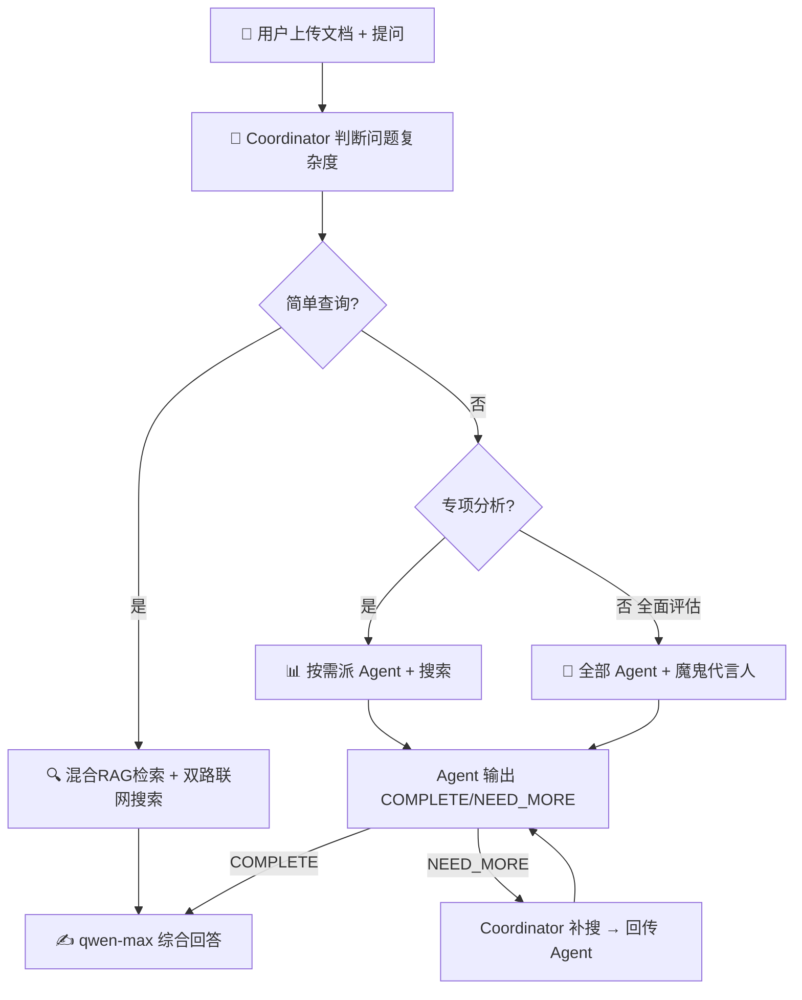

# 🏦 FinRisk MultiAgent

<div align="center">

**多 Agent 协作金融风险智能分析系统**

[](https://www.python.org/)
[](https://streamlit.io/)
[](LICENSE)
[-orange.svg)](https://dashscope.aliyun.com/)

*不是一个 AI 回答你——而是一个 AI 分析团队在帮你分析金融风险*

</div>

---

## 📌 这是什么？

FinRisk MultiAgent 是一个基于**多智能体协作（Multi-Agent Collaboration）**架构的金融文档风险分析平台。

上传一份金融文档，提出风险相关问题。系统内置的 **Coordinator（协调 Agent）** 自动判断问题复杂度——简单查数据自己搜索回答、专项分析调度相关专家、全面评估启动完整 Agent 编队——最后综合成结构化报告。

### 核心特色

- 🧠 **Coordinator 驱动**: LLM 驱动的协调 Agent，按问题复杂度自动选择策略（ReAct 决策循环）
- 🤖 **Agent 自主判断**: 每个 Agent 分析后声明 `[COMPLETE]`（信息足够）或 `[NEED_MORE]`（需要搜索），Coordinator 汇总决定是否继续
- 📎 **混合 RAG 检索**: 关键词精确匹配 + FAISS 语义检索，目录页自动降权，低质量文本自动过滤
- 🌐 **双路联网搜索**: DDGS（拿 URL）+ DashScope enable_search（拿详实内容），并行执行
- 📊 **RAG 评估体系**: RAG Triad 三维量化评估（Context Relevance / Faithfulness / Answer Relevance），不靠感觉调参
- 🔑 **用户自有 API Key**: 不内置任何密钥

---

## 🏗️ 系统架构



### Coordinator 三步策略

| 问题类型 | Coordinator 策略 | 示例 |
|----------|-----------------|------|
| **简单查询** | 自己搜索 + 直接回答，不派 Agent | "2026年一季度利润是多少？" |
| **专项分析** | 先搜文档和网络 → 需要才派专家 → Agent 自判是否够 | "偿债能力怎么样？" |
| **全面评估** | 搜 → 派多位专家并行 → 魔鬼代言人质疑 | "做个全面风险评估" |

### 四个专业 Agent

每个 Agent 用专业能力**回答问题**，不是机械填充检查清单。输出末尾声明完整性：

| Agent | 角色 | 工作方式 |
|-------|------|----------|
| 📊 **数据提取** | CFA+CPA 审计专家 | 先理解问题 → 只提取相关数据 → `[COMPLETE]` 或 `[NEED_MORE]` |
| ⚠️ **风险评估** | 18年风控经验 | 只分析用户关心的维度 → 自判信息是否足够 |
| 📋 **合规审查** | 前证监会预审员 | 聚焦用户问的合规领域 → 不够就说需要搜什么 |
| 🔍 **深度质疑** | 桥水 Red Team | 只质疑相关问题 → 弹药不够就申请搜索 |

---

## 🚀 快速开始

### 前置要求

- Python 3.10+
- [DashScope API Key](https://dashscope.console.aliyun.com/apiKey)

### 1. 克隆项目

```bash
git clone https://github.com/leokiy/finrisk-multiagent.git
cd finrisk-multiagent
```

### 2. 安装依赖

```bash
pip install -r requirements.txt
```

### 3. 启动

```bash
python -m streamlit run app.py
```

### 4. 使用

1. 浏览器打开 `http://localhost:8501`
2. 左侧边栏输入 DashScope API Key
3. 上传金融文档（PDF / TXT / MD）
4. 勾选 🌐 联网搜索
5. 提问——Coordinator 自动判断策略

---

## 📂 项目结构

```
finrisk-multiagent/
├── app.py                      # Streamlit 主界面（中英双语）
├── requirements.txt            # Python 依赖
├── .env.example                # 环境变量模板
├── README.md
│
├── src/
│   ├── orchestrator_v2.py      # 🧠 Coordinator（ReAct决策循环 + Agent完整性判断）
│   ├── agents/
│   │   ├── base.py             # Agent 基类：混合RAG + 简报注入 + LLM调用
│   │   ├── data_extractor.py   # 📊 数据提取 Agent
│   │   ├── risk_assessor.py    # ⚠️ 风险评估 Agent
│   │   ├── compliance_checker.py # 📋 合规审查 Agent
│   │   └── devils_advocate.py  # 🔍 深度质疑 Agent
│   ├── rag/
│   │   └── engine.py           # RAG 模块：关键词+FAISS混合检索·表格提取·低质量过滤
│   ├── search/
│   │   └── web_search.py       # 联网搜索：DDGS(URL) + enable_search(内容) 双路
│   └── llm/
│       └── client.py           # LLM 客户端：DashScope + OpenAI兼容·流式输出
│
├── prompts/                    # 📝 Prompt 模板
│   ├── zh/                     # 中文
│   └── en/                     # English
│
├── eval/                       # 📊 RAG 评估体系
│   ├── golden_set.json         # Golden Test Set
│   └── evaluator.py            # RAG Triad 评估器 (CR / Faith / AR)
│
└── examples/
    └── sample_report.md
```

---

## 🔧 技术栈

| 层级 | 技术 | 说明 |
|------|------|------|
| **前端** | Streamlit | 纯 Python Web UI |
| **LLM** | DashScope (Qwen) / OpenAI 兼容 | turbo/plus/max |
| **Coordinator** | ReAct 决策循环 | LLM 驱动的任务分解和调度 |
| **RAG** | 关键词精确匹配 + FAISS 语义检索 | 双路融合，低质量自动过滤 |
| **联网搜索** | DDGS + enable_search | URL + 详实内容双路并行 |
| **文档处理** | pdfplumber + LangChain TextSplitter | PDF 文本提取 + 表格结构化 |

---

## 📊 RAG 评估体系

基于 **RAG Triad** 框架的量化评估：

| 维度 | 衡量 | 
|------|------|
| **Context Relevance** | 检索到的文档段落对回答问题有帮助吗？ |
| **Faithfulness** | 回答严格基于文档/搜索结果，没有编造吗？ |
| **Answer Relevance** | 回答正面、直接地回应用户问题了吗？ |

```bash
python eval/evaluator.py --api-key $DASHSCOPE_API_KEY --pdf path/to/test.pdf
```

---

## 🎯 适用场景

| 场景 | 说明 |
|------|------|
| **投资尽调** | 快速分析目标公司的财务风险和合规状况 |
| **持仓监控** | 定期审查持仓标的的风险变化 |
| **信用评估** | 评估债券发行人的信用风险 |
| **合规自查** | 对照监管框架检查信息披露的完整性 |
| **监管科技** | 辅助监管机构进行信息披露合规检查 |

---

## ⚠️ 免责声明

本系统由 AI 驱动，分析结果**仅供参考**，不构成投资建议或法律意见。

---

## 📄 License

MIT License — 详见 [LICENSE](LICENSE) 文件。
