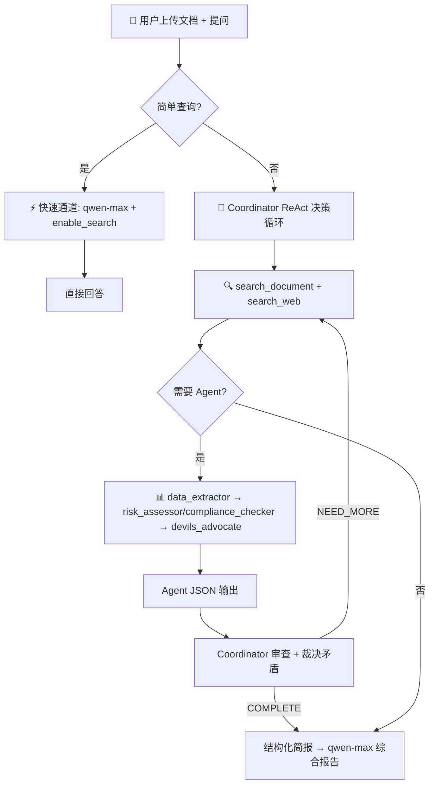

# 🏦 FinRisk MultiAgent

<div align="center">

**多 Agent 协作金融风险智能分析系统**

[](https://www.python.org/)
[](https://streamlit.io/)
[](LICENSE)
[-orange.svg)](https://dashscope.aliyun.com/)
[](Dockerfile)

*不是一个 AI 回答你——而是一个 AI 分析团队在帮你分析金融风险*

</div>

---

## 📌 这是什么？

FinRisk MultiAgent 是一个基于**多智能体协作（Multi-Agent Collaboration）**架构的金融文档风险分析平台。

上传金融文档（或不传，直接提问），系统内置的 **Coordinator（协调 Agent）** 自动判断问题复杂度——简单查数据走快速通道直接回答，专项分析调度相关专家，全面评估启动完整 Agent 编队——最后综合成结构化报告。

### 核心特色

- 🧠 **Coordinator 驱动**: ReAct 决策循环，自动判断问题类型并选择策略
- 🤖 **工业级 Agent 定义**: 每个 Agent 有明确的输入/输出契约、成功标准、失效行为——参考 Anthropic agency-agents 框架
- ⚡ **快速通道**: 简单查数据（"…是多少？"）直接调用 qwen-max + enable_search，不绕编排器
- 📊 **Agent JSON 输出**: 所有 Agent 输出结构化 JSON，Coordinator 直接解析路由，不再从原始文本重复提取
- 📎 **混合 RAG 检索**: 关键词精确匹配 + FAISS 语义检索，目录页自动降权，低质量文本自动过滤
- 🌐 **enable_search 联网搜索**: DashScope 原生搜索，国内直连，无需 VPN
- 💬 **对话上下文**: 支持追问，系统理解"那同比增长呢？"中的指代关系
- 📄 **文档可选**: 不上传文档也能直接提问，纯靠联网搜索；上传文档后自动提取公司名限定搜索范围
- 🔒 **安全校验**: 文件上传大小/类型/MIME 三重校验，API Key 脱敏
- 🐳 **Docker 支持**: 一键容器化部署
- 🔑 **用户自有 API Key**: 不内置任何密钥

---

## 🏗️ 系统架构



### Agent 输出契约

每个 Agent 返回结构化 JSON，Coordinator 直接使用，不再重复 LLM 提取：

| Agent | 输出 Schema |
|-------|------------|
| 📊 data_extractor | `{status, data: [{metric, value, source_type, source}]}` |
| ⚠️ risk_assessor | `{status, findings: [{dimension, fact, judgment, risk_level, evidence}]}` |
| 📋 compliance_checker | `{status, findings: [{area, finding, verdict, evidence}]}` |
| 🔍 devils_advocate | `{status, challenges: [{target, target_conclusion, challenge, severity, evidence}]}` |

### Coordinator 决策策略

| 问题类型 | 策略 | 示例 |
|----------|------|------|
| **简单查询** | 快速通道：qwen-max + enable_search 直接回答 | "2026年一季度利润是多少？" |
| **专项分析** | 搜 → data_extractor → risk_assessor/compliance_checker → devils_advocate | "偿债能力怎么样？" |
| **全面评估** | 搜 → data_extractor → risk_assessor + compliance_checker 并行 → devils_advocate | "做个全面风险评估" |
| **文档分析** | search_document 优先，search_web 仅补充，文档数据 vs 网络数据冲突时以文档为准 | "分析这份财报" |

---

## 🚀 快速开始

### 前置要求

- Python 3.10+
- [DashScope API Key](https://dashscope.console.aliyun.com/apiKey)

### 1. 克隆项目

```bash
git clone https://github.com/leokiy/finrisk-multiagent.git
cd finrisk-multiagent
```

### 2. 安装依赖

```bash
pip install -r requirements.txt
```

### 3. 配置 API Key（可选）

```bash
cp .env.example .env
# 编辑 .env，填入你的 DASHSCOPE_API_KEY
```

或在启动后于侧边栏输入。

### 4. 启动

```bash
# 直接启动
python -m streamlit run app.py

# 或使用 Docker
docker compose up -d
```

### 5. 使用

1. 浏览器打开 `http://localhost:8501`
2. 左侧边栏输入 DashScope API Key
3. （可选）上传金融文档（PDF / TXT / MD）
4. 提问——Coordinator 自动判断策略
5. 支持追问，系统理解对话上下文

---

## 📂 项目结构

```
finrisk-multiagent/
├── app.py                      # Streamlit 主界面（中英双语）
├── requirements.txt            # Python 依赖
├── Dockerfile                  # Docker 镜像
├── docker-compose.yml          # Docker Compose 配置
├── .env.example                # 环境变量模板
├── README.md
│
├── src/
│   ├── orchestrator_v2.py      # 🧠 Coordinator（ReAct决策循环 + Agent编排）
│   ├── agents/
│   │   ├── base.py             # Agent 基类
│   │   ├── data_extractor.py   # 📊 数据提取 Agent
│   │   ├── risk_assessor.py    # ⚠️ 风险评估 Agent
│   │   ├── compliance_checker.py # 📋 合规审查 Agent
│   │   └── devils_advocate.py  # 🔍 深度质疑 Agent
│   ├── rag/
│   │   └── engine.py           # RAG 模块：关键词+FAISS混合检索
│   ├── search/
│   │   └── web_search.py       # 联网搜索：enable_search
│   └── llm/
│       └── client.py           # LLM 客户端：DashScope + OpenAI兼容
│
├── prompts/                    # 📝 Prompt 模板
│   ├── zh/                     # 中文（工业级：含输入/输出契约、失效行为）
│   └── en/                     # English
│
├── eval/                       # 📊 RAG 评估体系
│   ├── golden_set.json         # Golden Test Set
│   └── evaluator.py            # RAG Triad 评估器
│
└── examples/
    └── sample_report.md
```

---

## 🔧 技术栈

| 层级 | 技术 | 说明 |
|------|------|------|
| **前端** | Streamlit | 纯 Python Web UI |
| **LLM** | DashScope (Qwen) / OpenAI 兼容 | turbo/plus/max |
| **Coordinator** | ReAct 决策循环 + Agent 编排 | LLM 驱动的任务分解和调度 |
| **RAG** | 关键词精确匹配 + FAISS 语义检索 | 双路融合，embedding 失败自动降级为关键词 |
| **联网搜索** | DashScope enable_search | 国内直连，超时 30s 兜底 |
| **文档处理** | pdfplumber + LangChain TextSplitter | PDF 文本提取 + 表格结构化 |
| **部署** | Docker + docker-compose | 一键启动 |

---

## 🎯 适用场景

| 场景 | 说明 |
|------|------|
| **投资尽调** | 快速分析目标公司的财务风险和合规状况 |
| **持仓监控** | 定期审查持仓标的的风险变化 |
| **信用评估** | 评估债券发行人的信用风险 |
| **合规自查** | 对照监管框架检查信息披露的完整性 |
| **监管科技** | 辅助监管机构进行信息披露合规检查 |
| **通用金融问答** | 不传文档，直接提问——系统联网搜索最新数据回答 |

---

## ⚠️ 免责声明

本系统由 AI 驱动，分析结果**仅供参考**，不构成投资建议或法律意见。LLM 输出具有非确定性，关键财务决策请以官方披露文件为准。

---

## 📄 License

MIT License — 详见 [LICENSE](LICENSE) 文件。
